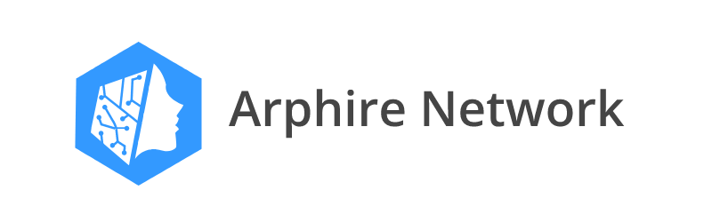

## A sandbox project of a decentralized ecosystem with its own economy

### Project Letter

Геополитика показывает, что в мире нарушаются многие процессы, когда существует централизованное управление системами. Биткоин показал альтернативу банковским структурам, блокчейн стал инструментом децентрализованных сервисов, возвращающих контроль от обезличенных серых механизмов обратно к людям. Жизнь слишком коротка, чтобы работать на механизмы и самому быть шестеренкой в системе, которую чрезвычайно сложно переписать, попытки таких изменений каждый раз приводят к дестабилизации общества.

Arphire Network - это альтернативный сценарий развития децентрализованного мира. Мы пытаемся создать новый общественный договор. Инструменты для новых видов социального взаимодействия. Экосистему. Собственную экономику. Децентрализованную науку. Пространство для творчества и работы.

К принципам проекта относятся: простота технологии, неограниченное масштабирование, гибкость для развития.

---

Подпишись, чтобы следить за обновлениями 

---

